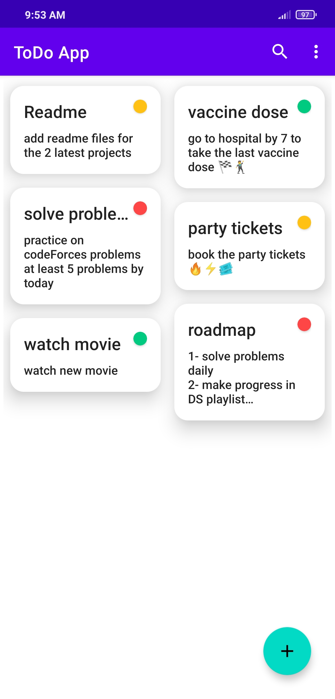
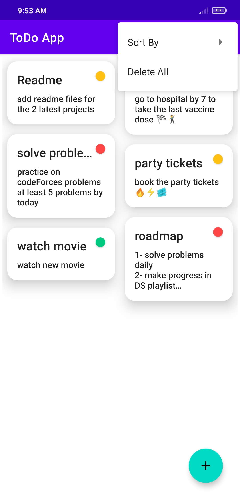
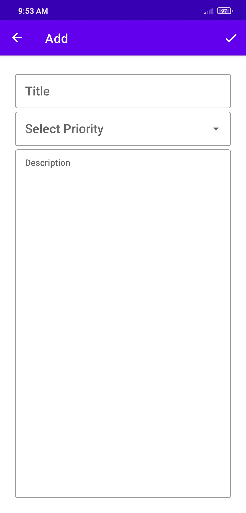
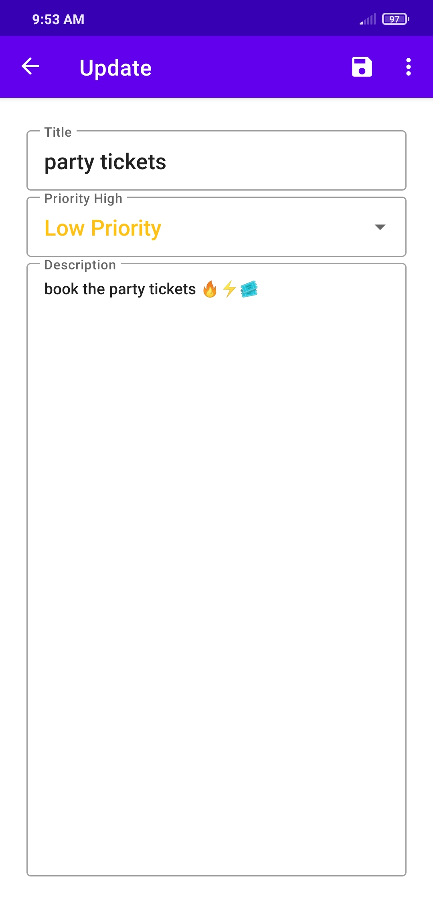

# ToDo App

Save your notes and todo jobs with content description in 3 differnet priorities


## You can:

* Sort the notes by its priority
* Search through the database by note title
* Edit the note content or priority and delete the note


## Getting Started

download the repo as zip file or you can clone it from link below:

```
https://github.com/Ahmed-P-Mostafa/ToDo-App.git
```


## Prerequisites

The things you'll need in order to use the app and how to install them

* only mobile phone.


### How to use


   

https://user-images.githubusercontent.com/61784191/131763319-0c8f979c-4602-4cdd-83b6-47494ea375e5.mp4


## Built with

* [Kotlin 1.5.10](https://kotlinlang.org/) - The programming languages used
* MVVM - Design Pattern
* Kotlin Flow
* Room Database
* Data-Binding
* Binding Adapters
* Kotlin Coroutines
* Navigation Component
